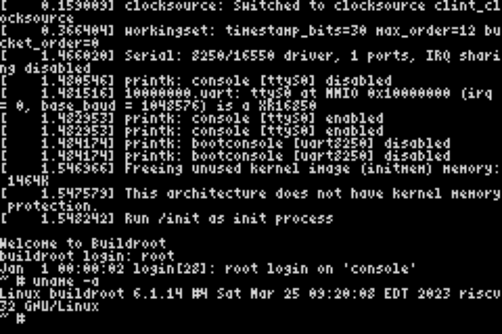

# r2-gba

Runs the r2 RISC-V core on a Game Boy Advance and boots Linux on it
(the same `fixtures/linux.bin` + `default.dtb` as the other frontends).



## How it fits in 288KB of RAM

It doesn't. Flash carts that run games out of PSRAM (EZ-Flash, EverDrive, ...)
expose the 32MB GamePak ROM window as writable memory, so:

| GBA address               | Use                                       |
| ------------------------- | ----------------------------------------- |
| `0x08000000-0x08FFFFFF`   | this program + embedded kernel image/DTB  |
| `0x09000000-0x09FFFFFF`   | guest RAM (16MB, guest `0x80000000-`)     |
| IWRAM                     | the interpreter loop (ARM code) and stack |
| VRAM (Mode 3)             | 60x26 text console (4x6 font)             |

At boot the kernel is copied into guest RAM and the DTB is placed at its end
(its memory size is patched like mini-rv32ima does).

The guest clock is derived from the instruction count (16 instructions per
µs), so the guest sees a 16 MIPS machine and timing is deterministic.
WFI fast-forwards the clock to the next timer interrupt.

## Build

Needs a nightly toolchain with `rust-src` (picked up from `rust-toolchain.toml`).

```sh
make            # target/r2-gba.gba
make baremetal  # target/r2-gba-baremetal.gba (tiny test program)
```

## Run

On [rgba](https://github.com/bokuweb/rgba) with PSRAM emulation:

```sh
RGBA_PSRAM=1 rgba target/r2-gba.gba
```

The console is also mirrored to the mGBA debug log. The login prompt is
answered automatically (`root`), and `uname -a` runs at the first prompt. Each button types a command:

| Button | Command             |
| ------ | ------------------- |
| A      | `uname -a`          |
| B      | `ls /`              |
| L      | `cat /proc/cpuinfo` |
| R      | `free`              |
| START  | `uptime`            |
| SELECT | `ps`                |

## Speed

About 70 ARM instructions per RISC-V instruction, roughly 110K guest
instructions per second on a 16.78MHz GBA. Reaching the login prompt takes
about 40M guest instructions, i.e. several minutes of GBA time.
